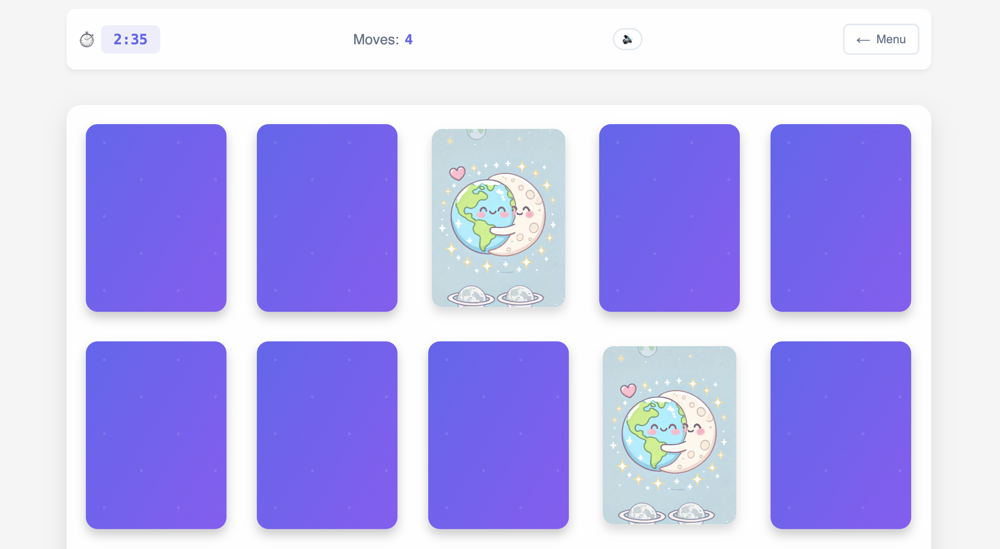
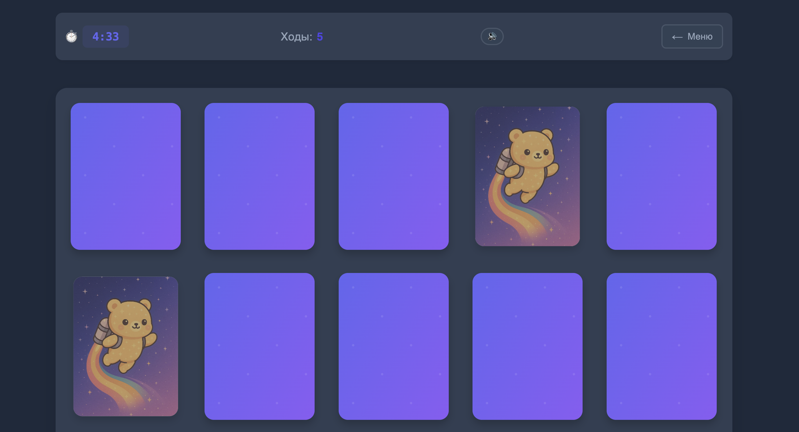

# Memory Game 🎮

<div align="center">
  
  
  
</div>

## 🌐 Language Navigation
- [English 🇬🇧](#english)
- [Русский 🇷🇺](#russian)

## English 🇬🇧

### 🎯 Description
Memory Game is a modern, interactive card matching game that challenges players to find pairs of identical cards within a limited time. The game features stunning AI-generated space and meme-themed cards, smooth animations, and an engaging user experience.

### ✨ Key Features
- 🎨 **Beautiful Design**
  - Modern, responsive UI
  - Smooth animations and transitions
  - Dark/Light theme support
  - Custom card designs with 3D flip effect

- 🎮 **Gameplay**
  - Three difficulty levels (Easy, Medium, Hard)
  - 15 unique card pairs (30 cards total)
  - Time limit for each level
  - Move counter
  - Progress tracking

- 🎵 **Audio & Effects**
  - Background music
  - Sound effects
  - Audio controls

- 🌍 **Localization**
  - Russian/English language support
  - Easy language switching
  - Culturally adapted content

- 📱 **Responsive Design**
  - Works on all devices
  - Adaptive grid layout
  - Touch-friendly controls



### 🛠️ Technologies Used
- Vue.js 3 - Progressive JavaScript framework
- Vite - Next Generation Frontend Tooling
- CSS3 - Modern styling with variables and animations
- JavaScript ES6+ - Modern JavaScript features
- LocalStorage - For saving user preferences

### 🚀 Installation
1. Clone the repository
```bash
git clone https://github.com/your-username/memory-game.git
```

2. Install dependencies
```bash
cd memory-game
npm install
```

3. Run the development server
```bash
npm run dev
```

4. Build for production
```bash
npm run build
```

## Русский 🇷🇺

### 🎯 Описание
Memory Game - это современная интерактивная игра на запоминание карточек, где игроку нужно найти пары одинаковых карточек за ограниченное время. Игра включает потрясающие карточки с космической тематикой и мемами, созданные с помощью ИИ, плавные анимации и увлекательный пользовательский опыт.

### ✨ Основные возможности
- 🎨 **Красивый дизайн**
  - Современный адаптивный интерфейс
  - Плавные анимации и переходы
  - Поддержка темной/светлой темы
  - Специальный дизайн карточек с 3D-эффектом переворота

- 🎮 **Игровой процесс**
  - Три уровня сложности (Легкий, Средний, Сложный)
  - 15 уникальных пар карточек (всего 30 карточек)
  - Ограничение времени для каждого уровня
  - Счетчик ходов
  - Отслеживание прогресса

- 🎵 **Аудио и эффекты**
  - Фоновая музыка
  - Звуковые эффекты
  - Управление звуком

- 🌍 **Локализация**
  - Поддержка русского и английского языков
  - Простое переключение языка
  - Адаптированный контент

- 📱 **Адаптивный дизайн**
  - Работает на всех устройствах
  - Адаптивная сетка
  - Удобное управление на сенсорных экранах



### 🛠️ Используемые технологии
- Vue.js 3 - Прогрессивный JavaScript фреймворк
- Vite - Инструмент нового поколения для фронтенда
- CSS3 - Современные стили с переменными и анимациями
- JavaScript ES6+ - Современные возможности JavaScript
- LocalStorage - Для сохранения пользовательских настроек

### 🚀 Установка
1. Клонируйте репозиторий
```bash
git clone https://github.com/your-username/memory-game.git
```

2. Установите зависимости
```bash
cd memory-game
npm install
```

3. Запустите сервер разработки
```bash
npm run dev
```

4. Соберите проект для продакшена
```bash
npm run build
```
